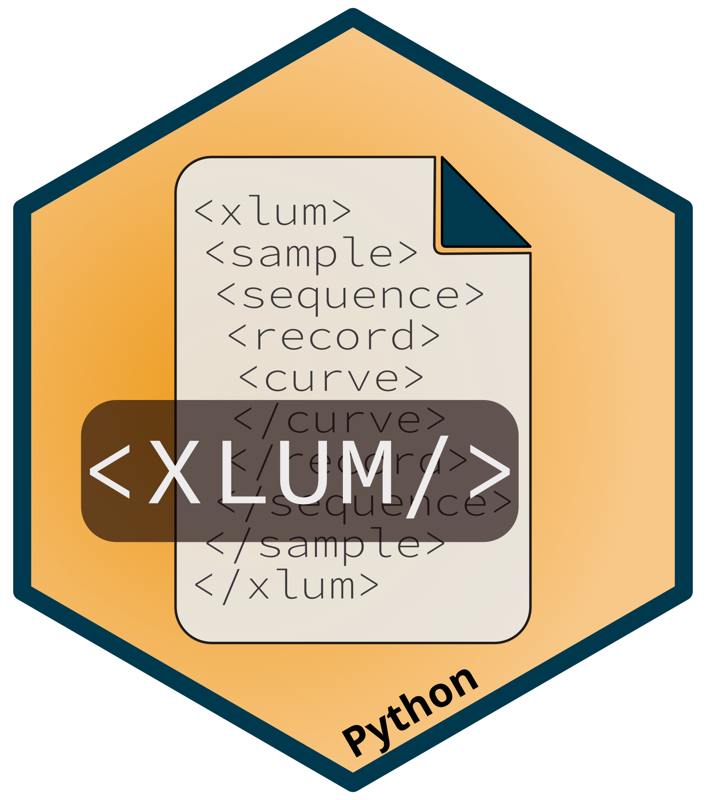

# xlum-python 

Python importer for the [XLUM data exchange and archive format](https://github.com/R-Lum/xlum_specification)

## System requirements

- lxml https://pypi.org/project/lxml/
- pandas https://pandas.pydata.org/
- urllib3 https://urllib3.readthedocs.io/en/stable/
- openpyxl https://openpyxl.readthedocs.io/en/stable/
- Access to GitHub for XSD schema validation
  
## Installation

```console
$ pip install xlum
```

## Usage
```python
## simple import
import xlum

meta_obj = xlum.from_xlum(file_name="<Path to Xlum>")

### more sophisticated examples with plotting
import xlum
import matplotlib
from matplotlib import pyplot as plt
from tkinter.filedialog import askopenfilename

filename = askopenfilename()
obj = xlum.from_xlum(filename)

for sample in obj.lstSamples:
    for idx_s, sequence in enumerate(sample.lstSequences):
        for idx_r, record in enumerate(sequence.lstRecords):
            plt.figure(idx_s*100+idx_r)
            for curve in record.lstCurves:
                plt.plot(curve.lstValues, "o-", label=f"{curve.component} - {curve.vLabel} in [{curve.vUnit}] '{curve.curveType.name.lower()}'")
                plt.xlabel(f"{curve.tLabel} in [{curve.tUnit}]")
                if curve.yLabel != "NA":
                    plt.ylabel(f"{curve.yLabel} in [{curve.yUnit}]")
            plt.title(
                f"""
                {obj.author}
                {sample.name}: {sample.mineral} from ({sample.longitude:.2f}, {sample.latitude:.2f}, {sample.altitude:.2f})
                {sequence.fileName} by {sequence.software}
                {record.recordType.name}{' - '+ record._meta.comment if record._meta.comment != "NA" else ""}
                """
                )
            plt.legend()
plt.show()
```

## Citing
```
@Article{gchron-2022-27,
AUTHOR = {Kreutzer, S. and Grehl, S. and H\"ohne, M. and Simmank, O. and Dornich, K. and Adamiec, G. and Burow, C. and Roberts, H. and Duller, G.},
TITLE = {XLUM: an open data format for exchange and long-term data preservation of luminescence data},
JOURNAL = {Geochronology Discussions},
VOLUME = {2022},
YEAR = {2022},
PAGES = {1--22},
URL = {https://gchron.copernicus.org/preprints/gchron-2022-27/},
DOI = {10.5194/gchron-2022-27}
}
```

## Funding

The development of the XLUM-format as format basis for reference data was supported by the European Union’s Horizon 2020 research and innovation programme under the Marie Skłodowska-Curie grant agreement No 844457 [CREDit](https://cordis.europa.eu/project/id/844457)).
